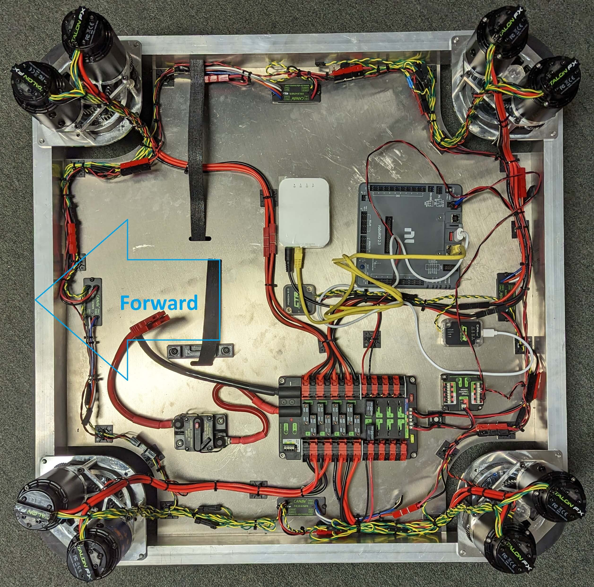

# Swerve Drive Robot

This contains the code for the Swerve Drive robot, using SDS MK4 modules along with 4 CANdles for underglow on each side.

# Steps to take for configuration

 1. Hand-Spin every motor (steer and drive) to check for friction/tight spots
 2. ID every motor as follows:
    - Steer motors even, Drive motors odd
    - Front Right with IDs 0,1
    - Front Left with IDs 2,3
    - Back Right with IDs 4,5
    - Back Left with IDs 6,7
 3. ID every CANcoder as follows:
    - Front Right 0
    - Front Left 1
    - Back Right 2
    - Back Left 3
 4. Put robot up on blocks so modules can freely drive and turn
 5. Using Tuner, drive every motor to make sure there are no tight spots
    - Start with driving a steer motor, and spin it forward and backward
    - When driving the drive motor, make note of which direction is forward and when finished, face it so forward points to the front of the robot.
 6. Use straight edge/pins/other mechanical means to align every wheel
 7. Go through each CANcoder and find the magnet offset
    1. Factory default CANcoder
    2. Self-test CANcoder
    3. Update offset in code to be the negative of reported position
